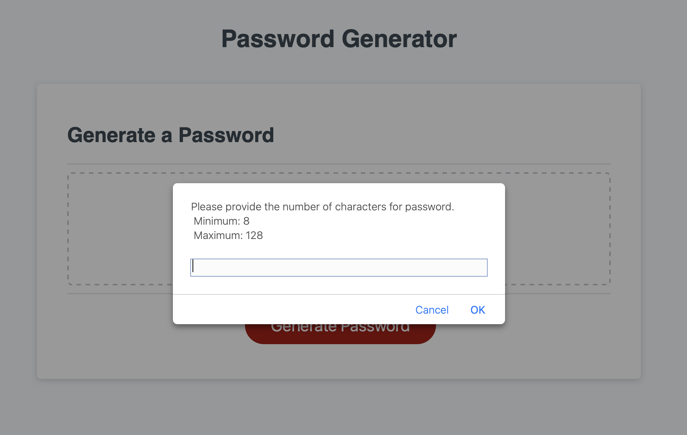

# [Passwordinator](https://sonali-pandey.github.io/passwordinator/)

## Generate the strongest password to keep your accounts super safe

* Click on Generate Password to start generating you new awesome password.
* Answer the prompts:
    * password length: minimun 8 and maximum 128
    * Characters you need in your unique password:
        * Lower case: Y or N
        * Upper case: Y or N
        * Numeric Value: Y or N
        * Special Character: Y or N
* That's it, your password will appear on the screen!

## Screens

 ### main Page
 

 ### password length prompt
 

 ### invalid length input alert
 

 ### password character criteria prompt
 

 ### invalid critera alert
 

## Thank you.
## Created by: [Sonali Pandey](github.com/sonali-pandey)

